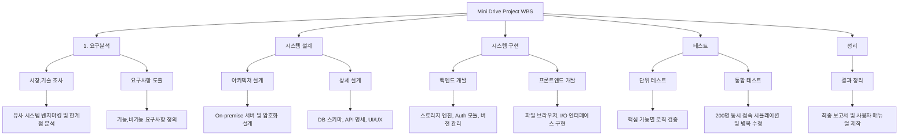
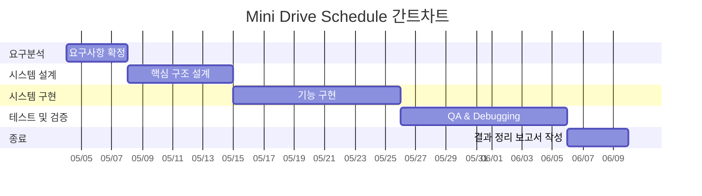

# 프로젝트 관리 계획서

## 1. 서론

### 1.1 프로젝트계획서 목적
이 문서는 사내 협업환경 개선을 위한 클라우드 스토리지 시스템 '미니드라이브 (Mini Drive)의 진행을 관리하기 위한 **Project Management Plan(프로젝트 관리 계획서)** 이다. 이 계획서는 프로젝트의 목표, 개발 일정, 품질 관리 방안 및 산출물 정의로 구성되어있고, 개발시 원활한 **팀원간의 communication과 효율적으로 자원을 배분**하는것을 목적으로 한다.

### 1.2 프로젝트 개요
기존의 분산된 파일 공유방식(예로, 이메일 메신져 등)에서 발생하는 버전 관리의 혼선과 데이터 유출 등의 리스크를 해결하기 위해, 보안이 강화된 On-premise형 중앙 집중식 스토리지를 구축한다.

- 1.2.1 프로젝트 정의 : 약 200명 규모의 사내 직원이 동시 접속이 가능한 웹 기만 클라우드 저장소 시스템 개발
- 1.2.1 주요 특징 : 대용량 설계 파일 처리 성능 확보, 권한기반의 Access Control(접근 제어), 메타데이터 기반의 빠른 검색 기능을 제공

### 1.3 프로젝트 목표
  1. Security 확보 : 사내망 내 데이터 보관 및 암호화 전송을 통해 외부 유출 가능성 원천 차단
  2. Reliability 극대화 : 파일 삭제시 복구기능 및 버전 관리 로직을 구현해서 데이터 무결성을 보장
  3. Performance 극대화 : 200명이 동시에 접속하는 환경에서 지연시간을 최소화 하는 경량 아키텍쳐를 구현

### 1.4 용어 정의
- Metadata : 데이터에 관한 데이터로, 본 시스템에서는 파일명, 업로드 날짜, 크기 등의 정보를 의미함
- Chunk Upload : 대용량 파일을 작은 단위로 쪼개어 전송함으로써 네트워크 불안정 시에도 재전송 효율을 높이는 방식

### 1.5 참조 문서
- [시스템 정의서](https://github.com/Anthony0966/SE/blob/main/doc/sys_def.md)
- [요구사항 정의서](https://github.com/Anthony0966/SE/blob/main/doc/sys_quality.md)

## 2. 개발 계획

### 2.1 개발 절차 모형
이 프로젝트는 폭포수모델을 채택하여 진행한다. 선택한 이유는 각 단계의 마감과 산출물이 명확해서 남은 기말고사까지 일정을 관리하는데에 최적화 되어있기 떄문이다. 또한 팀원들이 구성이 된다면, 팀원들끼리 상시로 회의를 하거나 협업을 하기 어려운 환경이므로, 문서에 기반을 해서 명확한 일정을 잡는것이 좋다고 생각했다. 폭포수모델의 단점인 경직성을 보완하기 위해서, 설계 단계 후반에 대용량 I/O처리를 검증하는 Prototyping 과정을 추가해서 기술적인 리스크를 미리 확인하여 보완하도록 한다.

### 2,2 WBS(Work Breakdown Structure)

### 2.3 개발 내용
- 요구분석
  - Functional Requirements : 파일 업로드/다운로드, 폴더 관리, 공유 링크 생성, Version Control System 등의 핵심 기능 명세화
  - Non-functional Requrements : 200명 동시 접속 시의 Throughput 확보 방안 및 AES-256 기반의 데이터 전송 보안 규격 수립
- 시스템 설계
  - Architecture Design : 경량화된 웹 서버와 파일 스토리지 엔진 간의 계층 구조 설계
  - Database Design : 파일의 위치, 소유권, 권한 정보를 담는 RDBMS (관계형 데이터베이스임) 스키마 설계 및 대용량 조회를 위한 인덱스 최적화
  - API Specification : 프론트엔드와 백엔드 간의 통신을 위한 RESTful API 인터페이스 정의
- 시스템 구현
  - Backend : Chunked Upload 로직 구현을 통해 대용량 파일 전송의 안정성을 확보하고, 파일 수정 시 Differential Storage  방식을 고려한 버전 관리 엔진 개발
  - Frontend : SPA(single page application)구조를 채택해서 사용자 경험(UX)를 개선하고 별도 설치 없이 브라우저에서 동작하는 파일 탐색기 UI 구현
- 테스트
  - Stress Test : 가상 유저 200명을 생성하여 동시 I/O 발생 시의 레이턴시 및 서버 가용성 검증
  - Security Audit : 암호화 전송 구간의 패킷 도청 방지 및 인가받지 않은 사용자의 접근 차단 테스트

### 2.4 개발 일정
폭포수 모델의 특성에 따라 이전 단계에서 산출물이 산출된 후에 다음 단계로 들어가는것을 원칙으로 한다.

| 단계 | 주요 작업 내용 | 기간 | 산출물 |
| :--- | :--- | :--- | :--- |
| **요구분석** | 요구사항 도출 및 **Specification** | 0.5주 | 요구사항 정의서 |
| **시스템 설계** | 아키텍처 설계 및 DB 스키마 정의 | 1주 | 시스템 설계서 |
| **시스템 구현** | 백엔드 엔진 및 프론트엔드 UI 개발 | 1.5주 | 구현 코드 |
| **테스트 및 검증** | 단위/통합 테스트 및 결함 수정 | 1.5주 | 테스트 결과 보고서 |
| **종료** | 최종 문서 정리 및 프로젝트 배포 | 0.5주 | 최종 보고서 |

## 4. 품질관리

### 4.1 팀 미팅 계획
- 정기미팅 : 매주 진행, (팀즈, zoon등 비대면 미팅 혹은 대면) - 주간 작업 진척도 및 Gantt Chart 대비 지연율 점검
- 각 파트 리뷰 미팅 : 요구사항, 설계, 구현 등 각 WBS 단계가 종료되는 시점에 모여 산출물 간의 **일관성** 을 체크

### 4.2 변경사항 관리
- 요구분석 단게가 종료되면, 이후에 발생하는 새 기능 추가 요건은 일단은 수용하지 않음
- 예외적으로, 시스템의 핵심 동작(1GB 업로드, Auth 인증 등)을 불가능하게 만드는 치명적인 설계 결함이 발견될 경우에만, 팀원 전원의 동의 하에, 범위를 축소하는 방향으로 설계를 변경

## 5. 개발환경

### 5.1 하드웨어 환경
추후 팀원과 협의 상황을 보고 결정 후 기술

### 5.2 소프트웨어 환경
추후 팀원과 협의 상황을 보고 결정 후 기술

## 6. 산출물 관리

- Sourcecode : **Git,Github**를 활용해서 활용하여 중앙 집중식으로 관리한다. 핵심 로직 구현 시 반드시 feature 브랜치를 파생하여 작업하고, 검증이 끝난 코드만 main 브랜치에 **Merge **한다
- Document : Notion 및 구글드라이브를 활용하여 공동작성한다
- Naming rule : 제출용 파일 생성시 형식을 강제(예: 260426_pmp_v1_변건일.pdf)

## 7. 기타사항

### 7.1 리스크 관리
약 5주 가량의 단기 일정으로 진행되므로, 발생가능한 리스크를 대비해서, 다음의 대응 계획을 세운다

- 기술적 리스크 : 대용량 파일의 Chunked Upload (청크 업로드) 로직 구현이 3주 차까지 완료되지 않을 경우 등 
    - 대응 방안 : 즉시 해당 기능을 **Backlog (백로그)**로 미루고, 50MB 이하의 단일 파일 업로드 기능으로 대체하여 전체 시스템의 통합 테스트 일정을 방어한다

- 일정 리스크 : 테스트 기간 부족 등
    - 대응방안 : 핵심 유즈케이스(로그인, 권한별 폴더 접근, 파일 업로드/다운로드)에 대해서만 Test Coverage 80% 달성을 우선 목표로 삼고, 부가 기능(검색 필터 등)의 테스트는 후순위로 미룬다

### 7.2 커뮤니케이션 채널
- 공식 회의 및 의사결정 : 카카오톡 단체 채팅방, 팀즈 혹은 zoom
- 이슈트래킹 및 일정 : Github Projects

## 8. 참고문헌 및 부록

### 8.1 참고문헌
1. [시스템 정의서](https://github.com/Anthony0966/SE/blob/main/doc/sys_def.md)
2. [요구사항 정의서](https://github.com/Anthony0966/SE/blob/main/doc/sys_quality.md)

### 8.2 부록
- 추후 회의록 등 추가 예정

  
